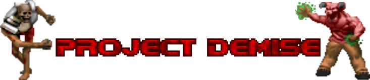
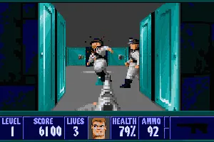

<div align="center">
  
</div>

Tecnologia de Raycasting simplificada incluso mas a la merced de usuarios de Python!!! Vuestra perturbada imaginacion es el limite

# Disclaimer del motor

El proyecto esta armado a base de un motor de raycasting sencillo implementado en C. Los tutoriales usados para armar la herramienta son los siguientes:

* Build your Own Raycaster 1: https://youtu.be/gYRrGTC7GtA?si=MbBYVKE_anjTvlOl
* Build your Own Raycaster 2: https://youtu.be/PC1RaETIx3Y?si=RP1vg7yldG_7naVo
* Build your Own Raycaster 3: https://youtu.be/w0Bm4IA-Ii8?si=uYQjnmqwymSxPu9E
# Disclaimer con codigo de Ejemplos

Todos los codigos de RayCasting con Python son un intento mio siguiendo este tutorial de implementacion de raycasting en PyGame.
Si te interesa saber mas del tema, puedes ver los tutoriales en: 

*  Floorcasting: https://youtu.be/2Yj5mmKWukw?si=yDYng4rWeI4sZxeb
*  RayCasting: https://youtu.be/4gqPv7A_YRY?si=WLRq5uRCKcoZpoTK
*  El ultimo ejemplo de RayCasting en donde el suelo se refleja es sacado directamente del Github en: https://github.com/FinFetChannel/RayCasting2021 (Ademas, tambien se han hecho uso de los sprites de prueba que proveia el chico en su GitHub para realizar los ejemplos)

Tambien tener en cuenta que para el Trabajo Parcial. Las pruebas para el compilador en ANTLR4 se encuentran en la carpeta Gramatica. Y que en esta tambien se encuentra una carpeta llamada driver-copia en caso de que hallan problemas.

## 📋 Tabla de contenidos
- [Disclaimer](#disclaimer-con-codigo-de-Ejemplos)
- [Estructura general](#estructura-general)
- [Declaraciones](#declaraciones)
  - [sprite](#sprite)
  - [filter](#filter)
  - [npc](#npc)
  - [music](#music)
  - [map](#map)
  - [lightning](#lightning)
  - [UI](#ui)
  - [npcPositioning](#npcpositioning)
  - [weapon](#weapon)
  - [weaponLogic](#weaponlogic)
  - [testCommand](#testcommand)
- [Comentarios](#comentarios)
- [Tokens y tipos de datos](#tokens-y-tipos-de-datos)
- [Reglas semánticas](#reglas-semánticas)
- [Advertencias](#advertencias)
- [Ejemplo completo](#ejemplo-completo)
# Que es Project Demise?

Es un lenguaje parseado con ANTLR y transpilado a C para despues pasarlo a codigo medio .ll y finalmente codigo objeto con la herramienta clang.
Su gramatica es directa, de tal forma que el usuario solo tiene que declarar variables y asignar texturas para poder realizar una prueba sencilla.

# Ejemplo breve 
```
// === Texturas de entorno ===
sprite wall  -> 'wall.jpg'
sprite floor -> 'floor.jpg'
sprite sky   -> 'sky.jpg'

// === Filtros visuales ===
filter(hotline,    ceiling)
filter(green_waste, floor)

// === Enemigos ===
npc imp       -> 'Imp.jpg'
npc Cacodemon -> 'Cacodemon.jpg'

// === Música ===
music -> 'Numb.mp3'

// === Test de motor ===
raycasting_test
```
# Porque realizamos Porject Demise?

Porque, aunque el raycasting sea una tecnica de simulacion 3D antigua, la gente sigue usandola para poder desarrollar sus primeros juegos en 3D de forma relativamente sencilla.
Proytectos como Wolfenstein 3D y toda la saga clasica de Doom ha dejado una huella en la implementacion de esta sagrada herramienta.
El problema viene cuando intentas realizar un proyecto como este en Python usando PyGame. El proceso puede tornarse a ser muy tedioso cuando intentas programar cosas que deberian ser basicas, y terminas confundiendote demasiado en configuraciones.



# Quienes son nuestro publico con este proyecto?

Esperamos que con este proyecto podamos alcanzar a aquellos modders de la comunidad de Doom y del raycasting en general para darle una probada a nuestra herramienta. Todos los que esten interesados en desarrollar su primer juego 3D son tambien bienvenidos a este dominio sagrado.


---

## Estructura general

Un programa Demise es una secuencia de **declaraciones** (`statement`) en cualquier orden, terminada por el fin de archivo. No hay una estructura de bloques obligatoria ni un orden forzado entre declaraciones (salvo las dependencias semánticas indicadas más abajo).

```
programa
  └── statement*
        ├── spriteDeclaration
        ├── mapDeclaration
        ├── npcDeclaration
        ├── npcPositioning 
        ├── musicDeclaration
        ├── weaponDeclaration
        ├── weaponLogic 
        ├── filter 
        ├── uiDeclaration 
        ├── lightningDeclaration
        ├── testCommand
        └── COMENTARIO
        └── ESPACIO
```

## Declaraciones

### `sprite`

Declara la textura que se usará para un tipo de superficie del entorno. Se aplica automáticamente durante el renderizado.

```
sprite <tipo> -> '<ruta>'
```

**Tipos válidos:** `wall` · `floor` · `sky`

```
sprite wall  -> 'wall.jpg'
sprite floor -> 'floor.jpg'
sprite sky   -> 'sky.jpg'
```

**Reglas semánticas:**
- El archivo referenciado debe existir en disco.
- Cada tipo (`wall`, `floor`, `sky`) solo puede declararse **una vez**.
- La ruta no puede estar en uso por otro símbolo.

---

### `filter`

Aplica un filtro visual (efecto de color o post-proceso) sobre una superficie del entorno.

```
filter(<nombre_filtro>, <target>)
```

**Targets válidos:** `floor` · `ceiling`

```
filter(hotline,    sky)
filter(bloody_moon, sky)
filter(green_waste, floor)
```
---

### `npc`

Declara un enemigo y la ruta al sprite que lo representa.

```
npc <nombre> -> '<ruta>'
```

```
npc imp       -> 'Imp.jpg'
npc Cacodemon -> 'Cacodemon.jpg'
npc Leo       -> 'Leo.jpg'
```

**Reglas semánticas:**
- El archivo referenciado debe existir en disco.
- El nombre de cada NPC debe ser **único**.
- La ruta no puede estar en uso por otro símbolo.

---

### `music`

Declara la pista de música de fondo del nivel. Sonará en loop infinito.

```
music -> '<ruta>'
```

```
music -> 'Numb.mp3'
```

**Reglas semánticas:**
- El archivo referenciado debe existir en disco.
- Solo puede declararse **una vez** por nivel.

---

### `map`

Define la matriz del mapa del nivel. Cada fila va entre corchetes `[...]` y el mapa termina con `;`.

```
map ->
[fila_0]
[fila_1]
...
[fila_N];
```

**Valores de celda:**

| Valor | Significado |
|-------|-------------|
| `0` | Espacio transitable (el jugador puede moverse aquí) |
| `1` | Pared (bloquea el movimiento y se renderiza con el sprite `wall`) |
| `2` | Salida del nivel |

```
map ->
[1 1 1 1 1 1 1 1 1 1]
[1 0 0 0 0 0 0 0 0 1]
[1 0 0 0 0 0 0 0 0 1]
[1 0 0 0 2 0 0 0 0 1]
[1 0 0 0 0 0 0 0 0 1]
[1 1 1 1 1 1 1 1 1 1];
```

> ⚠️ El punto y coma final `;` es **obligatorio**. Su ausencia genera un error sintáctico.

**Reglas semánticas:**
- Solo puede declararse **un mapa** por nivel.
- El mapa debe ser declarado **antes** de posicionar NPCs.

---

### `lightning`

Define el nivel de iluminación global del nivel.

```
lightning -> <valor>
```

```
lightning -> 50
```

**Rango válido:** `0` (oscuridad total) a `100` (iluminación máxima).

**Reglas semánticas:**
- El valor debe estar en el rango `[0, 100]`. Valores fuera de rango generan error.
- Solo puede declararse **una vez** por nivel.

---

### `UI`

Declara la imagen de la interfaz de usuario (HUD) que se superpondrá en pantalla durante el juego.

```
UI -> '<ruta>'
```

```
UI -> 'DoomUI.png'
```

**Reglas semánticas:**
- El archivo referenciado debe existir en disco.
- Solo puede declararse **una vez** por nivel.

---

### `npcPositioning`

Coloca un NPC previamente declarado en una posición específica del mapa.

```
<nombre_npc> -> (<col>, <fila>)
```

```
imp       -> (3, 3)
Cacodemon -> (2, 2)
```

**Reglas semánticas:**
- El **mapa debe haber sido declarado** antes de posicionar cualquier NPC.
- El NPC referenciado debe haber sido declarado previamente con `npc`.
- Las coordenadas `(col, fila)` deben estar dentro de los límites de la matriz del mapa. El acceso interno es `mapa[fila][col]`.

---

### `weapon`

Declara un arma y la ruta al sprite que la representa.

```
weapon <nombre> -> '<ruta>'
```

```
weapon shotgun -> 'Shotgun.png'
weapon BFG6000 -> 'BFG6000.png'
```

**Reglas semánticas:**
- El archivo referenciado debe existir en disco.
- El nombre de cada arma debe ser **único**.
- La ruta no puede estar en uso por otro símbolo.

---

### `weaponLogic`

Asigna un comportamiento de disparo predefinido a un arma declarada.

```
<nombre_arma> -> <comportamiento>
```

```
shotgun -> shotgun
BFG6000 -> BFG6000
```

**Comportamientos válidos:**

| Token | Descripción |
|-------|-------------|
| `chainsaw` | Motosierra  |
| `fist` | Puños  |
| `pistol` | Pistola  |
| `shotgun` | Escopeta |
| `chaingun` | Ametralladora |
| `rocket_launcher` | Lanzacohetes |
| `energy_rifle` | Rifle de energía |
| `BFG6000` | BFG 6000 |

**Reglas semánticas:**
- El arma referenciada debe haber sido declarada previamente con `weapon`.
- El comportamiento debe ser uno de los listados arriba. Cualquier otro valor genera un error.

---

### `testCommand`

Ejecuta un modo de prueba predefinido del motor de renderizado. Útil durante el desarrollo.

```
floorcasting_test
raycasting_test
raycasting_maze_test
```

| Comando | Descripción |
|---------|-------------|
| `floorcasting_test` | Prueba del renderizado de suelo y techo |
| `raycasting_test` | Prueba básica del motor de raycasting |
| `raycasting_maze_test` | Prueba del raycasting con un laberinto predefinido |

No requieren argumentos ni generan errores semánticos.

---

## Comentarios

Los comentarios son de una sola línea y comienzan con `//`. Pueden aparecer en cualquier lugar del programa.

```
// Esto es un comentario
sprite wall -> 'wall.jpg'   // Comentario al final de línea
```

---

## Tokens y tipos de datos

| Token | Formato | Ejemplo |
|-------|---------|---------|
| `STRING_LITERAL` | Texto entre comillas simples | `'wall.jpg'` |
| `INTEGER` | Número entero positivo | `50`, `0`, `100` |
| `ID` | Letra o `_`, seguido de letras, dígitos o `_` | `imp`, `BFG6000`, `my_npc` |
| `SPRITE_TYPE` | Palabra clave fija | `wall`, `floor`, `sky` |
| `WEAPON_LOGIC` | Palabra clave fija | `shotgun`, `BFG6000`, ... |
| `ARROW` | Símbolo de asignación | `->` |

> Los espacios y tabulaciones (`\t`, ` `) son ignorados por el lexer. Los saltos de línea son reconocidos como token `ESPACIO` pero no afectan la semántica.

---

## Ejemplo completo

```
// === Texturas de entorno ===
sprite wall  -> 'wall.jpg'
sprite floor -> 'floor.jpg'
sprite sky   -> 'sky.jpg'

// === Filtros visuales ===
filter(hotline,    ceiling)
filter(green_waste, floor)

// === Enemigos ===
npc imp       -> 'Imp.jpg'
npc Cacodemon -> 'Cacodemon.jpg'

// === Música ===
music -> 'Numb.mp3'

// === Mapa del nivel ===
map ->
[1 1 1 1 1 1 1 1 1 1]
[1 0 0 0 0 0 0 0 0 1]
[1 0 0 0 0 0 0 0 0 1]
[1 0 0 0 0 0 0 0 0 1]
[1 0 0 0 2 0 0 0 0 1]
[1 0 0 0 0 0 0 0 0 1]
[1 0 0 0 0 0 0 0 0 1]
[1 0 0 0 0 0 0 0 0 1]
[1 0 0 0 0 0 0 0 0 1];

// === Iluminación ===
lightning -> 50

// === HUD ===
UI -> 'DoomUI.png'

// === Posicionamiento de enemigos ===
imp       -> (3, 3)
Cacodemon -> (2, 2)

// === Armas ===
weapon shotgun -> 'Shotgun.png'
weapon BFG6000 -> 'BFG6000.png'

shotgun -> shotgun
BFG6000 -> BFG6000

// === Test de motor ===
raycasting_test
```
